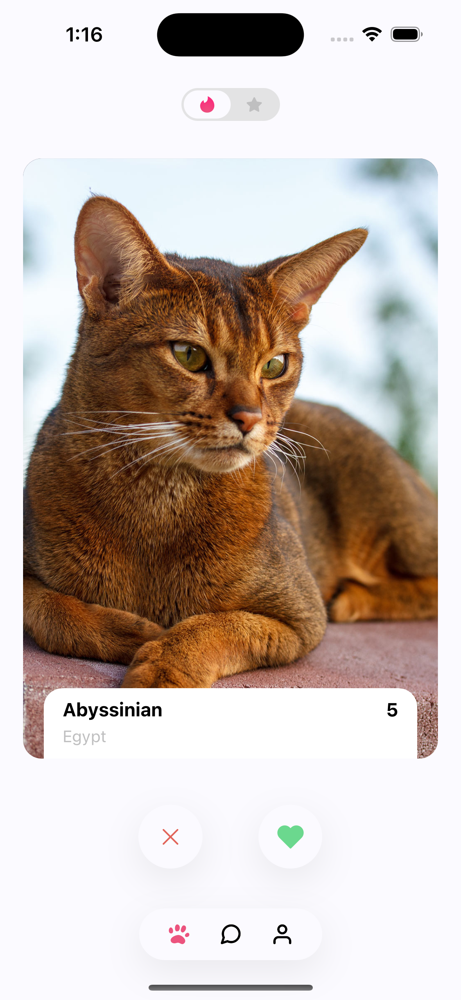

# Cat Tinder Challenge

Um desafio de React Native/Expo inspirado no Tinder, mas para gatos! O objetivo é treinar swipe, animações, integração com API, internacionalização e boas práticas de arquitetura.

## Sobre o projeto

O app permite que o usuário dê like/dislike em gatos, consumindo dados da TheCatAPI. O fluxo é todo animado, com navegação, tema centralizado, tipografia customizada e internacionalização.

### Principais features

- Swipe animado de cards de gatos
- Votação (like/dislike) via swipe ou botões
- Integração com TheCatAPI
- Internacionalização (i18n)
- Snackbar para feedback de erro
- Tipografia e tema customizados
- Estrutura modular e pronta para escalar

## Screenshot



## Como rodar

1. Instale as dependências:
   ```bash
   yarn
   # ou
   npm install
   ```
2. Inicie o app com Expo:
   ```bash
   npx expo start
   ```

## Scripts principais

- `npm start` / `yarn start` → inicia o app com Expo
- `npm run android` / `yarn android` → roda no emulador/dispositivo Android
- `npm run ios` / `yarn ios` → roda no simulador iOS
- `npm run lint` / `yarn lint` → lint do código
- `npm run format` / `yarn format` → formata o código
- `npm run test` / `yarn test` → executa os testes
- `npm run test:coverage` / `yarn test:coverage` → coverage dos testes

---

Desafio para fins de estudo e demonstração de arquitetura React Native moderna.
